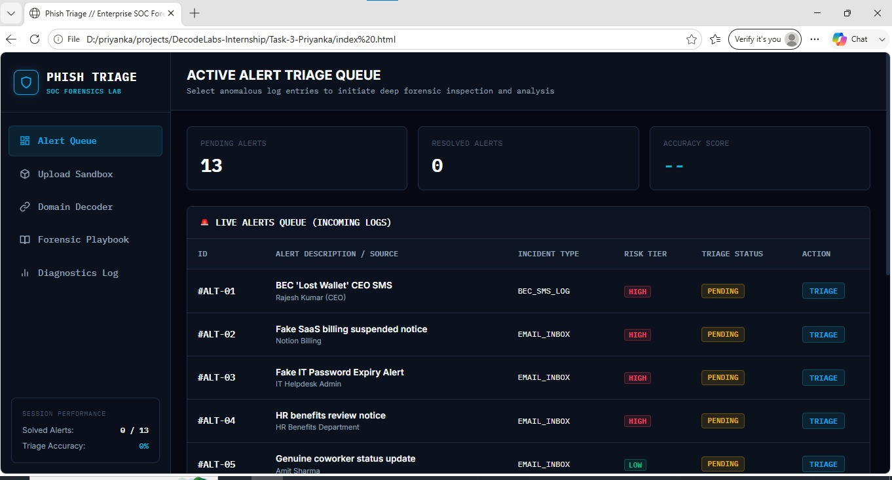

# DecodeLabs Cyber Security Internship Portfolio

This repository contains the cybersecurity internship projects and assignments completed by **Priyanka** during the DecodeLabs Cybersecurity Internship.


---

## 📁 Repository Structure

```text
DecodeLabs-Internship/
├── Task-1-Priyanka/               # Task 1: Password Strength Checker
│   ├── assets/                    # Task 1 preview screenshots
│   ├── app.js                     # Web UI frontend logic
│   ├── blacklist.txt              # Blacklisted passwords database
│   ├── core.py                    # Strength evaluation engine
│   ├── index.html                 # Web UI layout
│   ├── main.py                    # CLI main controller
│   ├── style.css                  # Web UI styles
│   ├── tests.py                   # Testing suite
│   ├── README.md                  # Task 1 documentation
│   └── PROJECT_REPORT.md          # Technical analysis report
│
├── Task-2-Priyanka/               # Task 2: Advanced Vigenère Cipher
│   ├── assets/                    # Task 2 preview screenshots (place screenshots here)
│   ├── index.html                 # Interactive landing page
│   ├── script.js                  # Frontend cipher logic & visualizer
│   ├── style.css                  # Custom cyberpunk styles
│   ├── vigenere.py                # Command-Line Python application
│   └── README.md                  # Task 2 documentation & math guide
│
├── Task-3-Priyanka/               # Task 3: Phishing Awareness Analysis (Phish Triage)
│   ├── assets/                    # Task 3 preview screenshots (place screenshots here)
│   ├── index.html                 # Interactive SOC-analyst triage simulator
│   ├── Phishing_Awareness_Analysis_Report.docx  # Methodology write-up & case studies
│   └── README.md                  # Task 3 documentation
│
├── .gitignore                     # Git ignore rules
├── LICENSE                        # Project License
└── README.md                      # Root repository guide (This file)
```

---

## 📂 Projects Portfolio

### 1. 🛡️ [Task 1: Password Strength Checker](./Task-1-Priyanka)
A comprehensive password security validation system that evaluates passwords and classifies them as Weak, Medium, or Strong while applying real-world cybersecurity rules (sequential keys, repeated characters, blacklist databases, and email-derived heuristics).

*   **Interfaces**: Interactive Web UI Landing Page (HTML/CSS/JS) & Terminal Command-Line Interface (Python).
*   **Concepts Demonstrated**: Entropy estimation, pattern matching, OSINT prevention, dictionary attacks, and modular testing.

#### 🖥️ Task 1 Web UI Dashboard Preview


---

### 2. 🔑 [Task 2: Advanced Vigenère Cipher System](./Task-2-Priyanka)
An advanced polyalphabetic substitution cipher application that allows users to encrypt and decrypt text. It features case preservation, non-alphabetic character alignment, an interactive CLI with step-by-step math explanations, and a real-time responsive web landing page.

*   **Interfaces**: Interactive Web UI Landing Page (HTML/CSS/JS) & Terminal Command-Line Interface (Python).
*   **Concepts Demonstrated**: Polyalphabetic substitution, modular arithmetic ($C_i = (P_i + K_i) \pmod{26}$), key alignment mapping, and real-time step-by-step visual calculations.

#### 🖥️ Task 2 Web UI Dashboard Preview


---

### 3. 🎣 [Task 3: Phishing Awareness Analysis](./Task-3-Priyanka)
An interactive SOC-analyst triage simulator ("Phish Triage") that teaches phishing detection through a weighted red-flag checklist and a formal decision-tree verdict system (Safe/Close → Suspicious/Warn → Malicious/Block). Covers 13 realistic phishing, BEC, and safe scenarios, including India-specific cases (UPI, IRCTC, PAN/Aadhaar, WhatsApp job scams) alongside global ones (BEC wire fraud, fake SaaS billing, deepfake calls).

*   **Interfaces**: Single-file interactive Web UI (HTML/CSS/JS, no backend) & accompanying Word report with full methodology and worked case studies.
*   **Concepts Demonstrated**: Red-flag taxonomy & weighted scoring, decision-tree triage logic, psychological-trigger analysis (Authority, Urgency, Curiosity, Fear-Greed), URL/subdomain deobfuscation, and threat-analysis documentation.

#### 🖥️ Task 3 Web UI Dashboard Preview


---

## 🛠️ Future Tasks (Coming Soon)
*   **Task 4**: *Awaiting Release*