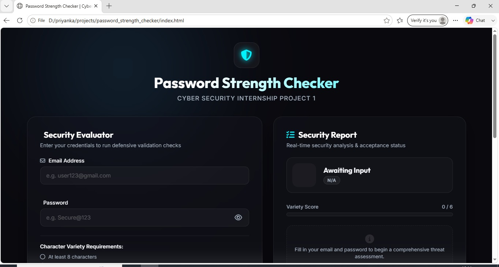

# DecodeLabs Cyber Security Internship Portfolio

This repository contains the cybersecurity internship projects and assignments completed during the DecodeLabs Internship.

---

## 📂 Projects Portfolio

### 1. 🛡️ [Project 1: Password Strength Checker](./project_1_password_strength_checker)
A comprehensive password security validation system that evaluates passwords and classifies them as Weak, Medium, or Strong while applying real-world cybersecurity rules (sequential keys, repeated characters, blacklist databases, and email-derived heuristics).

*   **Interfaces**: Interactive Web UI Landing Page (HTML/CSS/JS) & Terminal Command-Line Interface (Python).
*   **Concepts Demonstrated**: Entropy estimation, pattern matching, OSINT prevention, dictionary attacks, and modular testing.

#### 🖥️ Web UI Dashboard Preview

---

## 🛠️ Future Projects (Coming Soon)
*   **Project 2**: *Awaiting Release*
*   **Project 3**: *Awaiting Release*
*   **Project 4**: *Awaiting Release*
