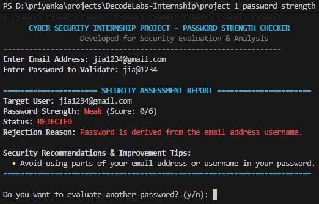
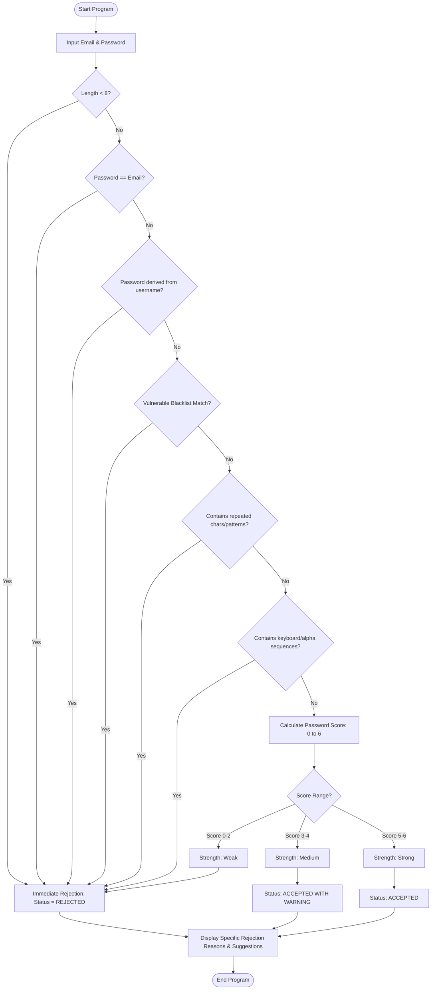

# Cyber Security Internship Project: Password Strength Checker

Welcome to the **Password Strength Checker** project. This is a comprehensive, production-quality, beginner-friendly cybersecurity validation utility designed to assess, score, and evaluate passwords based on modern corporate security standards, defensive validation policies, and industry best practices.

This repository serves as a complete project submission for a Cyber Security Internship. It contains modular code, automated test suites, sample data, and educational documentation.

---

## 📸 Screenshots & Previews

Here are visual previews of the interactive interfaces for this project:

### 1. Web Landing Page UI Dashboard

*A dark-mode glassmorphism web panel displaying real-time checklist feedback, variety scores, and warning messages.*

### 2. Terminal CLI Interface

*A command-line terminal output displaying colorized, structured security logs and recommendations.*

---

## 📂 Project Folder Structure

The project has been structured professionally to represent clean, production-grade software development practices:

```text
password_strength_checker/
│
├── blacklist.txt         # Newline-separated list of common weak/vulnerable passwords
├── core.py              # Core security logic, modular validation checks & scoring algorithm
├── main.py              # Interactive CLI command-line user interface (Terminal application)
├── tests.py             # Automated unit testing suite containing 28 security checks
├── index.html           # Gorgeous, interactive Web UI landing page
├── style.css            # Custom CSS styles (glassmorphism, dark theme, fluid animations)
├── app.js               # JavaScript validation engine for real-time frontend updates
├── README.md            # Project guide, Q&A, and educational cybersecurity explanations (This file)
└── PROJECT_REPORT.md    # Formal submission report document for academic/internship review
```

---

## ⚙️ Working Mechanism & Program Flow

The Password Strength Checker evaluates input passwords using a two-stage logic model: **Mandatory Immediate Rejection pre-checks** followed by a **Varied Character Scoring evaluation**.

### 1. Program Flow Diagram


---

## 🛠️ Validation Rules & Score Calculations

### Stage 1: Mandatory Pre-Checks (Immediate Rejection)
If any of these criteria fail, the password is **rejected immediately** and classified as **Weak** with a score of `0`:
*   **Minimum Length Check**: Password must be at least 8 characters long.
*   **Email Exact Match**: Password cannot match the email address.
*   **Email-Derived Passwords**: Extracts the username and checks for obvious variations. For example, if email is `abc22@gmail.com`, it splits username into segments `abc` and `22` and rejects passwords containing the full username (e.g. `abc22#Secure`) or all segments (e.g. `abc@22`).
*   **Common Password Blacklist**: Checks against a dictionary of vulnerable words stored in `blacklist.txt`.
*   **Repeated Character/Pattern Detection**: Detects sequential repetitions like `aaaaaa` (length 1 repeated $\ge 4$ times), `121212` (length 2 repeated $\ge 3$ times), or `abcabcabc` (length 3 repeated $\ge 3$ times).
*   **Sequential Pattern Detection**: Identifies sliding windows of length 5 or more in alphabetical sequence (`abcdef`), numerical sequence (`123456`), or keyboard layouts (`qwerty`, `asdfgh`).

### Stage 2: Password Strength Scoring
If the pre-checks pass, the password is given a score out of 6:
1.  **Length $\ge 8$ characters**: $+1$
2.  **Length $\ge 12$ characters (Bonus)**: $+1$
3.  **Contains at least one uppercase letter (A-Z)**: $+1$
4.  **Contains at least one lowercase letter (a-z)**: $+1$
5.  **Contains at least one numeric digit (0-9)**: $+1$
6.  **Contains at least one special character (`@ # $ % ^ & * ! ? _ -`)**: $+1$

### Stage 3: Acceptance Policy
*   **Score 0–2 (Weak)**: Status: `REJECTED`. User must choose a different password.
*   **Score 3–4 (Medium)**: Status: `ACCEPTED WITH WARNING`. User is prompted with security suggestions.
*   **Score 5–6 (Strong)**: Status: `ACCEPTED`. Password meets requirements.

---

## 🔐 Cybersecurity Concepts Applied

1.  **Dictionary Attacks & Blacklisting**: Attackers use precomputed lists of popular passwords to break into systems. A blacklist prevents users from selecting these known weak vectors.
2.  **Entropy (Password Strength)**: Entropy measures the uncertainty of a password. By demanding combinations of uppercase, lowercase, numbers, and special characters, we expand the character pool size ($R$), drastically increasing password space ($R^L$) and making brute-force attacks mathematically unfeasible.
3.  **Pattern Guessing & Predictability**: Standard strength checkers only count characters, meaning a password like `1234567890` might score highly. By writing custom logic for sequential and repeating patterns, we prevent predictable inputs.
4.  **Social Engineering & OSINT Countermeasures**: Users frequently incorporate bits of their personal info (like usernames, birthdays, or emails) into passwords. Protecting against email-derived passwords counters targeted profiling attacks.

---

## 💬 Interview Questions & Answers

### Q1: Why do we reject a password immediately instead of just assigning it a low score?
> **Answer**: From a defensive security perspective, certain structural flaws are so severe that no amount of character variety can compensate for them. For example, if a password is `qwerty123456!A`, it technically has uppercase, lowercase, numbers, symbols, and a length of 15. However, it contains two highly predictable sequential chains (`qwerty` and `123456`) which dictionary-based brute-force tools scan in milliseconds. Rejecting immediately stops these false-sense-of-security vulnerabilities.

### Q2: How does adding a special character or number increase a password's mathematical resistance?
> **Answer**: This relates to **Shannon Entropy**, calculated as:
> $$E = L \times \log_2(R)$$
> Where $L$ is password length and $R$ is the size of the character pool.
> If you only use lowercase letters, $R = 26$. For an 8-character password, the number of possibilities is $26^8 \approx 2.08 \times 10^{11}$.
> If you include uppercase, numbers, and symbols, the character pool grows to $R \approx 94$. The possible combinations become $94^8 \approx 6.09 \times 10^{15}$.
> This increases the search space by a factor of over **29,000**, rendering brute-force cracking exponentially more resource-intensive.

### Q3: What are the risks of using email-derived passwords?
> **Answer**: In credential stuffing and social engineering attacks, bad actors gather public identifiers (like email addresses from data leaks) and build custom dictionary lists using permutations of the target's username. Rejection of email-derived strings is a critical heuristic countermeasure.

---

## 🚀 Future Enhancements

*   **HaveIBeenPwned API Integration**: Connect to the HIBP API via HTTPS to check if the password has appeared in historical public data leaks using k-Anonymity hashing.
*   **Entropy Estimation Algorithm**: Use `zxcvbn` heuristics to measure real-world cracking difficulty (e.g., calculations of time-to-crack on modern GPU arrays).
*   **Web GUI Interface**: Build a React or Flask dashboard to showcase visual feedback and real-time visual progress bars.
