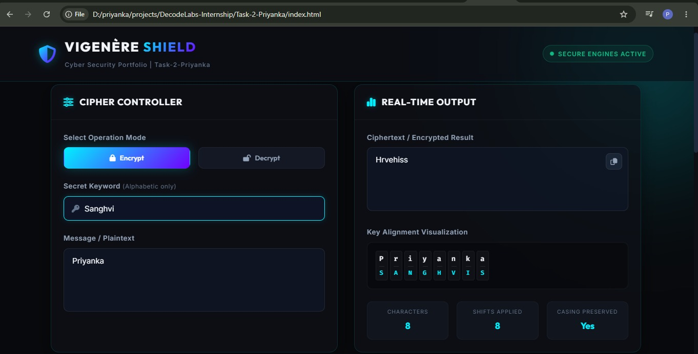
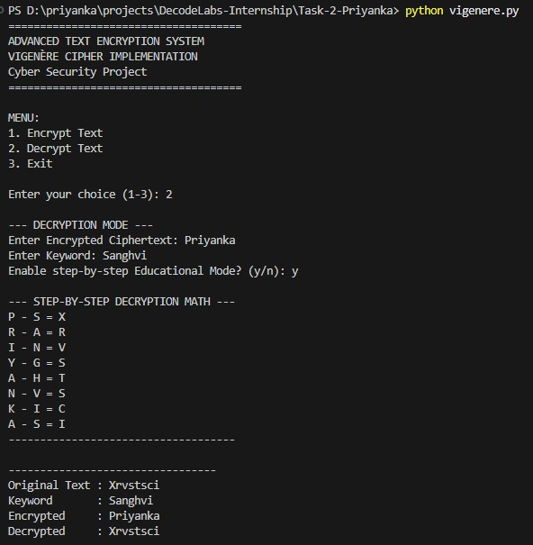

# Task 2: Advanced Text Encryption and Decryption using Vigenère Cipher

Welcome to the **Advanced Vigenère Cipher System**, a secure, console-based text encryption and decryption application written in Python. This project is designed as part of the **DecodeLabs Internship Portfolio** (Task-2-Priyanka).

It demonstrates fundamental cryptographic practices, input validation, polyalphabetic substitution mathematics, and provides a step-by-step **Educational Mode** to inspect shift calculations.


---

## 📁 Project Structure

```text
Task-2-Priyanka/
├── assets/             # Folder containing preview screenshots (web_preview.png, cli_preview.png)
├── index.html          # Interactive Web UI Landing Page
├── script.js           # Frontend interactive logic & dynamic visualizer
├── style.css           # Custom dark theme and glassmorphism styling
├── vigenere.py         # Modular Python CLI implementation
└── README.md           # Project documentation, mathematical formulas & guide (This file)
```

---

## 🖼️ Project Previews

### Web Landing Page Interface


### CLI Console Application


---

## 📖 Cryptographic Concepts

### 1. What is Encryption?
**Encryption** is the process of translating plaintext (readable, clear message) into ciphertext (unreadable, scrambled format) using a mathematical algorithm and a key. In cybersecurity, encryption is crucial for ensuring the **Confidentiality** of data, making it unreadable to eavesdroppers or unauthorized entities.

### 2. What is Decryption?
**Decryption** is the inverse of encryption. It converts the scrambled ciphertext back into its original, readable plaintext form using the same algorithm and key (for symmetric algorithms like the Vigenère Cipher).

### 3. What is the Vigenère Cipher?
The **Vigenère Cipher** is a method of encrypting alphabetic text by using a series of interwoven Caesar ciphers, based on the letters of a keyword. It is a polyalphabetic substitution cipher, which means a single letter in the plaintext can map to different letters in the ciphertext, depending on its position and the keyword.

### 4. How Shifts are Calculated
In the Vigenère Cipher, letters (A-Z) are mapped to integers from `0` to `25`:
$$A=0, B=1, C=2, \dots, Z=25$$

Let $P_i$ be the $i$-th letter of the plaintext, $K_i$ be the $i$-th letter of the aligned keyword, and $C_i$ be the resulting ciphertext letter.

* **Encryption Formula**:
  $$C_i = (P_i + K_i) \pmod{26}$$
* **Decryption Formula**:
  $$P_i = (C_i - K_i + 26) \pmod{26}$$

**Example:**
* Plaintext Character: `H` (Position `7`)
* Keyword Character: `K` (Position `10`)
* Encryption: $(7 + 10) \pmod{26} = 17$, which corresponds to letter `R`. (Math: `H + K = R`)
* Decryption: $(17 - 10 + 26) \pmod{26} = 7$, which corresponds to letter `H`. (Math: `R - K = H`)

---

## 💻 Line-by-Line Code Explanation

Here is a breakdown of how the functions in [vigenere.py](file:///D:/priyanka/projects/DecodeLabs-Internship/Task-2-Priyanka/vigenere.py) work:

### 1. `generate_key(msg, key)`
Aligns the keyword with the message so each alphabetic letter has a corresponding key character.
* **Line 52-53**: Initializes key conversion to uppercase and gets its length.
* **Line 54-55**: Initializes an empty list `generated_key` to build the aligned key string and a `key_index` tracker.
* **Line 57-61**: Iterates through each character in the message. If it is alphabetic (`isalpha()`), it selects the character from the key using modulo (`key_index % key_len`) to repeat it cyclically, then increments `key_index`.
* **Line 62-63**: If it's a number, punctuation, or space, it appends it directly to the key representation without incrementing `key_index`. This ensures the key sequence doesn't "skip" letters due to spaces/symbols.
* **Line 65**: Joins and returns the completed key string.

### 2. `encrypt(text, key_string, edu_mode=False)`
Performs the Vigenère Encryption math.
* **Line 81-83**: Checks if `edu_mode` is enabled to print a step-by-step header.
* **Line 85**: Zips the input message and aligned key string together, processing character pairs.
* **Line 86-98**: If the plaintext character is alphabetic:
  * Identifies its casing to get the baseline ASCII code (97 for `'a'` or 65 for `'A'`).
  * Maps plaintext to `0-25` range (`p_val`) and key letter to `0-25` range (`k_val`).
  * Applies the modulo math: `c_val = (p_val + k_val) % 26`.
  * Converts back to ASCII and appends.
  * In `edu_mode`, prints: `{P_char} + {K_char} = {C_char}`.
* **Line 99-101**: If not alphabetic, preserves the character as-is.

### 3. `decrypt(text, key_string, edu_mode=False)`
Reverses the Vigenère encryption to recover the original plaintext.
* **Line 117-119**: Educational output header if `edu_mode` is True.
* **Line 121**: Zips ciphertext and key string.
* **Line 122-134**: If ciphertext letter is alphabetic:
  * Maps to `0-25` range (`c_val`) and key letter to `0-25` range (`k_val`).
  * Applies the modulo subtraction math: `p_val = (c_val - k_val + 26) % 26`.
  * Converts back to character and appends.
  * In `edu_mode`, prints: `{C_char} - {K_char} = {P_char}`.
* **Line 135-137**: Preserves numbers, spaces, and punctuation unchanged.

### 4. `display_result(original, keyword, encrypted, decrypted)`
Formats and outputs the results in the requested format:
```text
---------------------------------
Original Text : <text>
Keyword       : <keyword>
Encrypted     : <ciphertext>
Decrypted     : <plaintext>
---------------------------------
```

### 5. `main()`
* Prints the cybersecurity application banner.
* Launches an interactive console loop with menu choices: Encrypt Text, Decrypt Text, or Exit.
* Implements robust validation loops checking that the message and keyword are not empty and that the keyword consists only of alphabetic letters.

---

## ⚡ Complexity Analysis

Let $N$ be the number of characters in the message/text, and $M$ be the length of the keyword.

| Operation | Time Complexity | Space Complexity | Explanation |
| :--- | :--- | :--- | :--- |
| **Key Generation** | $\mathcal{O}(N)$ | $\mathcal{O}(N)$ | We iterate through the message of length $N$ once. The space complexity is $\mathcal{O}(N)$ to store the generated aligned key string. |
| **Encryption** | $\mathcal{O}(N)$ | $\mathcal{O}(N)$ | We iterate through the message characters, doing constant time ($\mathcal{O}(1)$) arithmetic shifts. We store the result in a list of size $N$. |
| **Decryption** | $\mathcal{O}(N)$ | $\mathcal{O}(N)$ | Similar to encryption, we loop $N$ times and store the decrypted characters in a list. |

---

## 🧪 Sample Input & Output Examples

### Example 1: Encryption (Normal Mode)
* **Menu Choice**: `1`
* **Input Message**: `Hello, World!`
* **Input Keyword**: `KEY`
* **Educational Mode**: `n`

```text
MENU:
1. Encrypt Text
2. Decrypt Text
3. Exit

Enter your choice (1-3): 1

--- ENCRYPTION MODE ---
Enter Message/Text: Hello, World!
Enter Keyword: KEY
Enable step-by-step Educational Mode? (y/n): n

---------------------------------
Original Text : Hello, World!
Keyword       : KEY
Encrypted     : Rijvs, Uyvjn!
Decrypted     : Hello, World!
---------------------------------
```

### Example 2: Encryption (Educational Mode)
* **Menu Choice**: `1`
* **Input Message**: `Hello`
* **Input Keyword**: `KEY`
* **Educational Mode**: `y`

```text
MENU:
1. Encrypt Text
2. Decrypt Text
3. Exit

Enter your choice (1-3): 1

--- ENCRYPTION MODE ---
Enter Message/Text: Hello
Enter Keyword: KEY
Enable step-by-step Educational Mode? (y/n): y

--- STEP-BY-STEP ENCRYPTION MATH ---
H + K = R
E + E = I
L + Y = J
L + K = V
O + E = S
------------------------------------

---------------------------------
Original Text : Hello
Keyword       : KEY
Encrypted     : Rijvs
Decrypted     : Hello
---------------------------------
```

---

## 🚀 How to Run the Project

1. Ensure you have Python installed (version 3.6 or higher).
2. Open a terminal or command prompt.
3. Navigate to the project directory:
   ```cmd
   cd D:\priyanka\projects\DecodeLabs-Internship\Task-2-Priyanka
   ```
4. Run the script:
   ```cmd
   python vigenere.py
   ```
